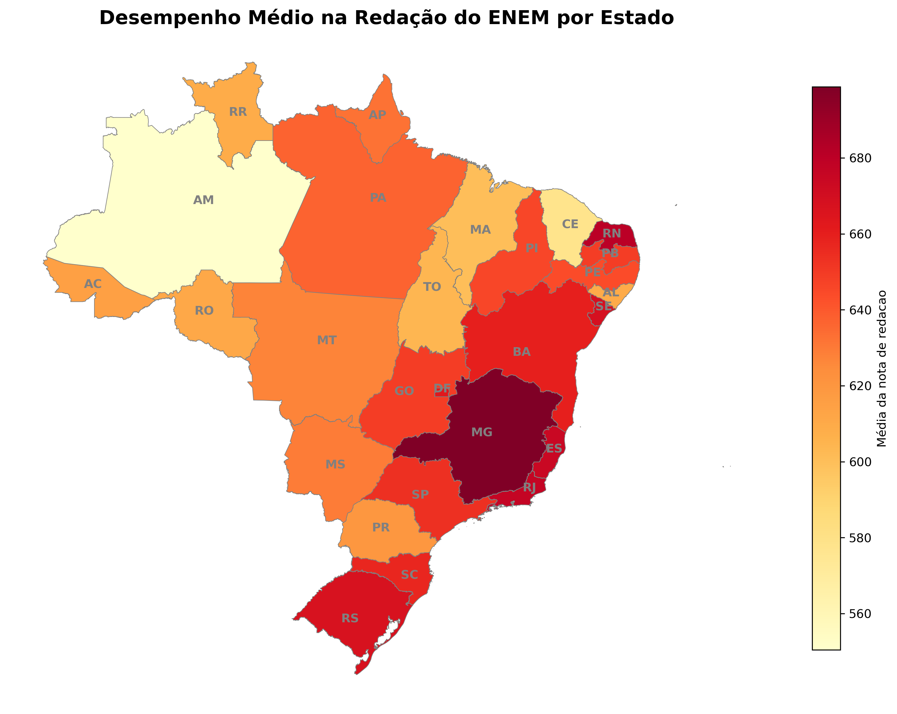

<h1> Mapa de Desempenho de Redação do Enem 2023 por Estado📉</h1>

<h2>Resumo</h2>

<h2>Projeto de análise e visualização espacial do desempenho médio dos candidatos na prova de redação do ENEM - 2023. Com o uso de ferramentas de inteligência geográfica, é apresentada a desigualdade regional de ensino entre os estados.</h2>

<h2>Bibliotecas aplicadas</h2>

- Linguagem: Python.
- Manipulação de dados: Pandas.
- Dados Geoespaciais: GeoPandas e GeoBr.
- Visualização: Matplotlib.

<h2>Metodologia</h2>

- Extração: média de redação utilizando a base de microdados.
- Geometria: Consumo da base oficial de mapas do IBGE via geobr.

- Tratamento: Limpeza de strings (remoção de espaços) para garantir o merge perfeito entre os dados tabulares e espaciais.

- Plotagem: Geração do mapa coroplético com marcação dos centróides (siglas dos estados).
